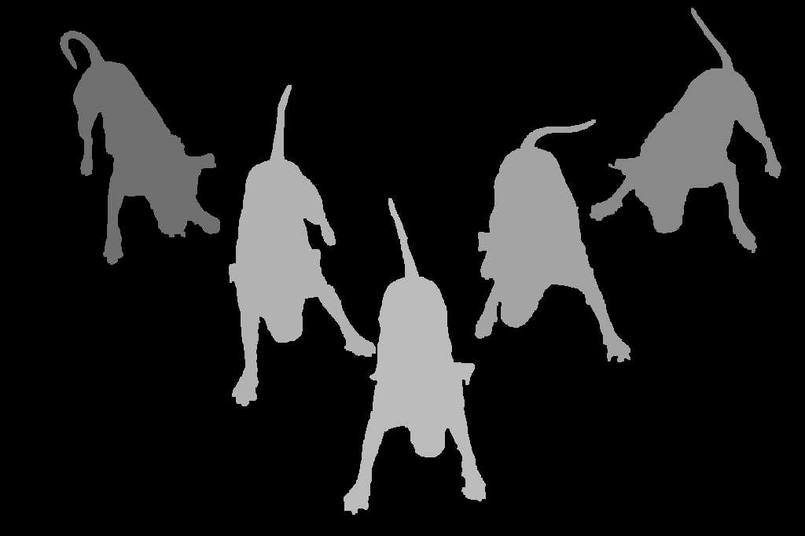
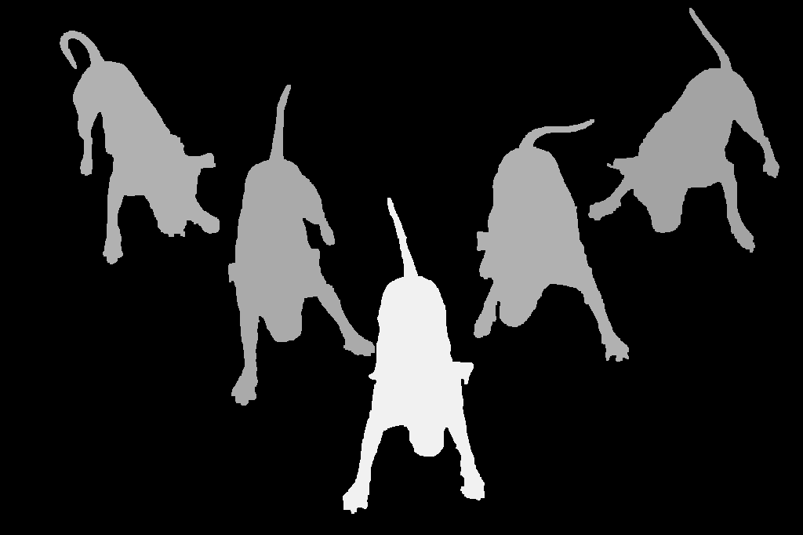
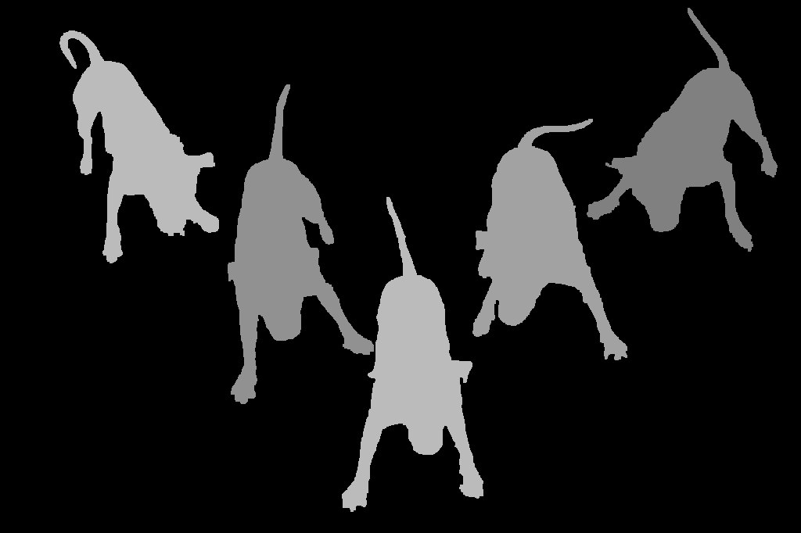

# Evaluating Salient Object Detection in Natural Images with Multiple Objects having Multi-level Saliency

Salient object detection is evaluated using binary ground truth with the labels being salient object class and background. In this paper, we corroborate based on three subjective experiments on a novel image dataset that objects in natural images are inherently perceived to have varying levels of importance. Our dataset, named SalMoN (saliency in multi-object natural images), has 588 images containing multiple objects. The subjective experiments performed record spontaneous attention and perceptionthrough eye fixation duration, point clicking and rectangle drawing. As object saliency in a multi-object image is inherently multi-level, we propose that salient object detection must be evaluated for the capability to detect all multi-level salient objects apart fromthe salient object class detection capability. For this purpose, we generate multi-level maps as ground truth corresponding to all thedataset images using the results of the subjective experiments, with the labels being multi-level salient objects and background. We then propose the use of mean absolute error, Kendall’s rank correlation and average area under precision-recall curve toevaluate existing salient object detection methods on our multi-level saliency ground truth dataset. Approaches that represent saliency detection on images as local-global hierarchical processing of a graph perform well in our dataset.

# The SalMoN Dataset

Google Drive link to [the SalMoN Dataset](https://drive.google.com/file/d/1C4tE-j7yvCo88n1qXLlmw_o160QHEOhE/view?usp=sharing)

You can browse the images and the saliency maps by clicking on the "viewDataset.html" inside the dataset file. A sample from our dataset is shown below:

|Original Image|Eye Fixation Density|Eye Tracking Saliency|Point Clicking Saliency|Rectangle Drawing Saliency|
|-|-|-|-|-|
||||||

You can analyze various data modalities (point clicks, rectangle coordinates etc.) by loading the following file in Python (tested in Python 3.6, with pickle :

```
import pickle

data = pickle.load(open("multilevel_saliency_data.pkl", "rb"))
```

